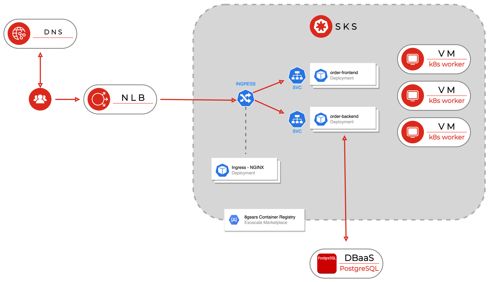

# Exoscale drink order demo

This application makes it possible for visitors to order drinks at a bar. They can write a nickname and choose a drink. The bar can see orders by using a special URL.

It represents an example of how a real world application can look like on Exoscale SKS and DBaaS.

It consits of a frontend, a backend, and kubernetes manifests.

## Backend

The backend is a simple NodeJS application with Express, consisting of two API Calls and Socket.IO.

It uses node-postgres to save orders to a PostgreSQL database. When a order is saved, it is also emited via
Socket.IO, so that viewers have a live-ticker of incoming orders.

Via an API Call, all orders of the database can be listed.

The application is horizontally scaleable as it's stateless. However the Socket.IO part isn't completly, as clients can only see incoming orders on the replica of the app where there are connected to (can be easily fixed by using Socket.IO adapters). The GET orders API call always show all orders, as they are retrieved from the DB.

## Frontend

The frontend uses NodeJS and [Svelte](http://svelte.dev) (one-page framework like Angular or Vue but lightweight).

It generates a UUID and saves it into the browseres local storage, the UUID is sent with an order to uniquly identify it. It also connects to the backend via SocketIO and displays incoming orders this way.

The app is fully horizontally scalable.

Special URLS:  
`?bar` - requests all orders and shows them  
`?qr` - Shows the main page but with a QR code at the bottom  

## Docker and Kubernetes

See the README in the k8s folder.

## Adding drinks

Drinks need to be only added in the frontend.

Go to `frontend/src/App.svelte` and edit the drinks JSON array respectivly. Also add language strings in `frontend/locale`

## Improvements for real-world applications

Access to DBaaS can be restricted to be only possible from the cluster [DBaaS filter](https://github.com/exoscale-labs/sks-sample-manifests/tree/main/exo-k8s-dbaas-filter). 

The client has no authentification for the overview of orders. Orders cannot be deleted.

Socket.IO adapters can be used for the backend (in conjunction with PostgreSQL), to make the live-ticker fully scalable.

Error handling in the backend can be improved.

## Architecture

## Disclaimer

This example is provided as-is and can be modified freely. Refer to [Exoscale SKS SLA](https://community.exoscale.com/documentation/sks/overview/#service-level-and-support) to understand the limits of Exoscale Support. If you find a bug or have a suggestion/improvement to make
we welcome issues or PR in this repository but take no commitment in integrating/resolving these.
